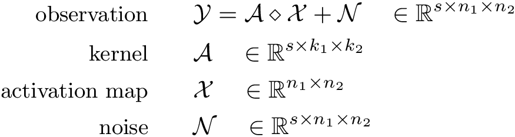

# Sparse blind deconvolution using the Riemannian Trust-Region Method (RTRM)
This package performs blind deconvolution under the data model

    

Here the *kernel* **A** is a "template signature" tensor that is measured across *s* "slices" and is small in size relative to the observation window. The observation consists of the collection of noisy 2D convolutions between the slices of **A** and a *sparse activation map* **X**. 

A nonconvex optimization problem is solved using RTRM to recover **A** and **X** from **Y** -- RTRM strongly guarantees that a local minimum will be found.

## Setup
 1. Ensure the ManOpt package is installed for RTRM [(http://www.manopt.org)](http://www.manopt.org).
 2. Download the `sbd-rtrm` package, and in MATLAB run `init_sbd.m` each time you want to use the tools from this package.
 3. Run `examples/simple_SBD_example.m` or `full_SBD_and_STM_example.m`.

## Core functions
### `SBD.m`
### `core\Asolve_Manopt.m`
### `core\Xsolve_pdNCG.m`

## Future updates
 - Add `Xpos` option to `SBD.m`
 - Create a RTRM package for CDL